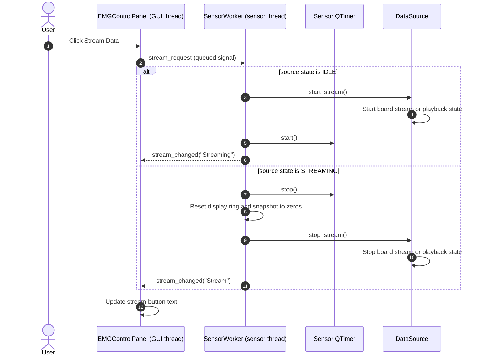
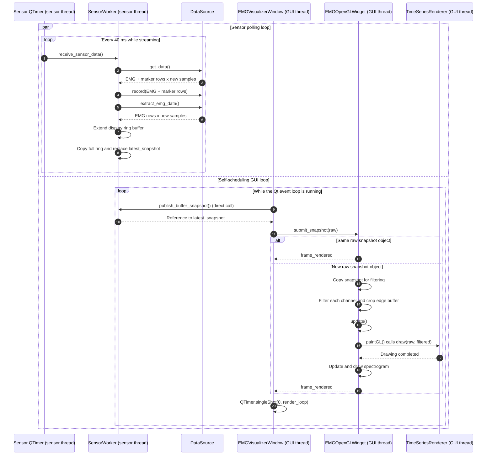

# Architecture

This document describes the current runtime architecture of `emg-gui` and
identifies connected components, partial behavior, and planned extraction points.

## Package Boundaries

The package is organized by application concept:

```text
src/emg_gui/
├── app.py                         Application composition and cleanup
├── acquisition/                   Board access, datasets, and sensor polling
│   ├── data_source.py
│   ├── dataset_files.py
│   └── sensor_worker.py
├── config/                        Runtime constants and packaged resources
├── core/                          Shared types, states, and logging interfaces
├── processing/                    Signal filters and window functions
├── ui/                            Qt controls and window composition
│   ├── control_panel.py
│   └── window.py
└── visualizer/                    OpenGL widget, renderers, and shaders
    ├── open_gl_widget.py
    ├── time_series_renderer.py
    ├── spectrogram_renderer.py
    └── shaders/
```

The acquisition package does not depend on Qt widgets or ModernGL. The UI
package composes the acquisition and visualization components, while the
visualizer package owns the OpenGL-specific implementation.

## Runtime Responsibilities

- `app.py` creates the shared logger and data source, starts the Qt application,
  and releases both resources after the Qt event loop exits.
- `DataSource` defines the acquisition interface. `OpenBCIBoard` is currently
  selected by `app.py` and delegates board access to BrainFlow's `BoardShim`.
  `PlaybackRecording` is available as an alternate file-backed implementation.
- `EMGVisualizerWindow` creates the control panel, sensor worker, sensor thread,
  and OpenGL widget. It also coordinates the self-scheduling rendering loop.
- `EMGControlPanel` owns the buttons and dataset selectors. It emits requests
  without importing or directly calling the window, worker, or board.
- `SensorWorker` owns the polling timer, display ring buffer, and latest complete
  EMG snapshot. Its polling and stream-control slots run on the sensor thread.
- `EMGOpenGLWidget` owns the Qt OpenGL lifecycle, skips duplicate snapshots,
  filters snapshot copies on the GUI thread, and submits frames to the
  renderers.
- `TimeSeriesRenderer` owns the wave shader program, dynamic vertex buffer, and
  vertex array. It currently draws raw and filtered EMG signals.
- `SpectrogramRenderer` owns the spectrogram shader program, texture array, and
  Hann-windowed STFT slice history. It is instantiated and drawn by
  `EMGOpenGLWidget`.

## Component Hierarchy

Status labels distinguish active runtime components from unfinished work:

- **Current**: implemented and connected to the active runtime.
- **Partial**: connected, but not all intended behavior is implemented.
- **Available**: implemented, but not connected to the active runtime.
- **Planned**: intended responsibility without a current implementation.

```text
emg-gui
└── app.py [current]
    ├── ConsoleLogger [current]
    ├── DataSource protocol [current]
    │   ├── OpenBCIBoard [current]
    │   │   └── BrainFlow BoardShim
    │   └── PlaybackRecording [available, not selected by app.py]
    └── EMGVisualizerWindow (QMainWindow) [current]
        ├── EMGControlPanel [current]
        │   ├── Stream control [current]
        │   ├── Recording control [current]
        │   ├── Movement marker control [current]
        │   ├── Reset control [partial: display buffer only]
        │   └── Dataset and recording-folder selection [current]
        ├── SensorThread (QThread) [current]
        │   └── SensorWorker [current]
        │       ├── Sensor QTimer [current]
        │       ├── DvG RingBuffer [current]
        │       ├── Latest channel-major snapshot [current]
        │       └── Injected DataSource [current]
        └── EMGOpenGLWidget (QOpenGLWidget) [current]
            ├── OpenGL 3.3 Core context [current]
            ├── Per-channel filter pipeline [current, GUI thread]
            ├── TimeSeriesRenderer [current]
            │   ├── Raw-signal layer [current]
            │   ├── Filtered-signal layer [current]
            │   └── Wave shaders and dynamic GPU buffer [current]
            ├── SpectrogramRenderer [current]
            │   ├── Hann-windowed STFT preparation
            │   ├── Texture array
            │   └── Spectrogram shaders
            ├── EMGSignalProcessor [planned extraction from the widget]
            └── OverlayRenderer [planned]
                ├── Countdown
                ├── Recording state
                └── Movement markers
```

## Data Layout

The acquisition and rendering stages intentionally use different orientations:

| Stage                             | Shape                            | Memory purpose                                                 |
| --------------------------------- | -------------------------------- | -------------------------------------------------------------- |
| `DataSource.get_data()`           | `(data_rows, new_samples)`       | Channel-major batch containing EMG rows and the marker row     |
| `DataSource.extract_emg_data()`   | `(emg_channels, new_samples)`    | EMG-only batch used by the display ring buffer                 |
| `SensorWorker.ring_buffer`        | `(buffer_samples, emg_channels)` | DvG RingBuffer elements are one sample across all EMG channels |
| `SensorWorker.latest_snapshot`    | `(emg_channels, buffer_samples)` | Independent, C-contiguous snapshot used by the GUI             |
| OpenGL raw and filtered snapshots | `(emg_channels, GUI_WIDTH)`      | Edge-artifact prefix removed before rendering                  |

With the current constants, `buffer_samples` is
`GUI_WIDTH + EDGE_ARTIFACT_BUFFER`, or `1,700`, and the rendered width is
`1,200`. The selected data source determines the EMG channel count. A Cyton board
exposes eight EMG channels, while BrainFlow's synthetic board exposes more EMG
channels. In both live and playback paths, the worker expects data rows to be EMG
rows plus a final marker row. Only EMG rows enter the display ring buffer.

## Data Flow

The selected data source provides EMG rows plus a marker row. For a real board,
BrainFlow stores incoming samples in its own board buffer and `OpenBCIBoard`
drains that buffer. For playback, `PlaybackRecording` slices the next samples
from the loaded recording. Every 40 ms while streaming, the sensor timer asks
the selected data source for the next available batch.

```mermaid
flowchart LR
    subgraph input["Data input"]
        board_buffer["BoardShim internal buffer"]
        playback["Loaded playback recording"]
    end

    subgraph sensor["Sensor thread"]
        source["DataSource.get_data()<br/>EMG + marker rows x new samples"]
        record["DataSource.record()<br/>append EMG + marker batch if recording"]
        extract["DataSource.extract_emg_data()<br/>EMG rows x new samples"]
        transpose["Transpose for RingBuffer"]
        ring["DvG RingBuffer<br/>1,700 x EMG channels"]
        latest["latest_snapshot<br/>EMG channels x 1,700"]

        source --> record
        source --> extract --> transpose
        transpose -->|"new samples x EMG channels"| ring
        ring -->|"transpose and C-order copy"| latest
    end

    subgraph gui["GUI / main thread"]
        loop["EMGVisualizerWindow.render_loop()"]
        widget["EMGOpenGLWidget.submit_snapshot()"]
        duplicate["Skip if same snapshot object"]
        filter_copy["Create independent filtering copy"]
        crop["Filter channels and remove 500-sample prefix"]
        wave["TimeSeriesRenderer.draw()"]
        spec["SpectrogramRenderer.add() and draw()"]
        gpu["ModernGL buffers, textures, and shaders"]

        loop --> widget
        widget --> duplicate
        duplicate -->|"new snapshot"| filter_copy --> crop
        duplicate -->|"same snapshot"| widget
        crop --> wave --> gpu
        crop --> spec --> gpu
    end

    board_buffer --> source
    playback --> source
    latest -->|"direct reference read"| loop
    gpu -->|"draw completes"| widget
    widget -->|"frame_rendered"| loop
```



`SensorWorker` first completes the ring-buffer copy and then replaces
`latest_snapshot` with one reference assignment. The GUI therefore reads either
the previous complete snapshot or the new complete snapshot. It does not read a
partially copied array.

The window passes the worker's snapshot as the raw input. `EMGOpenGLWidget`
first checks whether the raw snapshot is the same object as the last submitted
snapshot. If it is new, the widget creates one copy for in-place filtering.
Filtering runs over the full 1,700 samples so the first 500 samples can absorb
filter edge artifacts. Both arrays are then cropped to 1,200 samples for
rendering.

`TimeSeriesRenderer` normalizes raw and filtered signals using their combined
per-channel range. It draws the raw signal in gray and then overlays the
filtered signal in green.

`SpectrogramRenderer` receives the latest filtered 100-sample window, shifts its
texture history, writes a new STFT color slice, and draws the spectrogram layer.

## Thread Model

| Operation                                           | Thread                                    |
| --------------------------------------------------- | ----------------------------------------- |
| Construct logger and selected `DataSource`          | Main thread, before the Qt event loop     |
| Control-panel button handling                       | GUI thread                                |
| `SensorWorker.stream()` and `receive_sensor_data()` | Sensor thread                             |
| Record, marker, and reset worker slots              | Sensor thread                             |
| Data-source stream control and `get_data()`         | Sensor thread during normal operation     |
| Read `SensorWorker.latest_snapshot` reference       | GUI thread through a direct Python call   |
| Filtering and array preparation                     | GUI thread                                |
| `QOpenGLWidget` and ModernGL rendering              | GUI thread                                |
| Final board and logger release                      | Main thread after the Qt event loop exits |

Qt delivers control-panel signals to `SensorWorker` through the sensor thread's
event queue because the worker has been moved to that thread. In contrast,
`publish_buffer_snapshot()` is called directly by the window; it executes on the
GUI thread despite the worker object's sensor-thread affinity.

## Stream-Control Sequence



The record, marker, and reset buttons use the same queued signal route. Recording
toggles the data-source recording state and writes accumulated EMG-plus-marker
batches to CSV when stopped. Marker control inserts start/stop markers for the
live board implementation and updates activity state. Reset currently clears the
sensor worker's display ring buffer.

## Polling and Rendering Sequence

Sensor acquisition and GUI rendering are independent. The sensor loop is paced
by a 40 ms timer. The GUI render loop requests its next frame only after a real
OpenGL paint or duplicate-snapshot skip has completed.



If rendering is faster than sensor polling, the GUI can request the same
published snapshot more than once. `EMGOpenGLWidget` detects this by object
identity and skips duplicate filtering, OpenGL updates, time-series drawing, and
spectrogram history updates. Because the next zero-delay callback is registered
only after a real paint or duplicate skip completes, this loop does not build a
timer backlog of unfinished renders. It is still a fast polling loop while
waiting for new sensor data.

## Shutdown Sequence

```mermaid
sequenceDiagram
    autonumber
    actor User
    participant Window as EMGVisualizerWindow
    participant Worker as SensorWorker
    participant Thread as SensorThread
    participant GL as EMGOpenGLWidget
    participant App as app.py
    participant Source as DataSource
    participant Logger as ConsoleLogger

    User->>Window: Close window
    Window->>Worker: shutdown_timer() via BlockingQueuedConnection
    Worker->>Worker: Stop active sensor QTimer
    Window->>Thread: quit()
    Window->>Thread: wait()
    Note over Window,Thread: A running worker slot must return before the thread finishes
    Thread-->>Window: Thread event loop finished
    Window->>GL: release()
    GL->>GL: Release renderer and ModernGL resources
    Window-->>App: Qt event loop exits
    App->>Source: release()
    Note over Source: OpenBCIBoard stops active streams and releases BoardShim; PlaybackRecording no-ops
    App->>Logger: release()
```

## Current Limitations

- Reset currently clears the sensor worker's display ring buffer, but does not
  yet reset the spectrogram renderer history.
- Filtering currently runs inside `EMGOpenGLWidget` on the GUI thread. A separate
  signal processor remains a planned extraction point.
- Playback recording and CSV writing are currently no-ops.
- The time-series and spectrogram layout still use hardcoded per-channel spacing,
  so board-dependent channel counts can exceed the visible layout.
